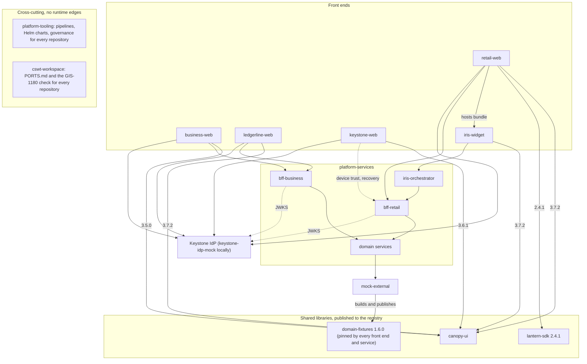

# Northgate CSWT digital estate — overview

One page on what the estate is, who owns which part, how the repositories depend on each other and
what runs in the back end. It is a map, not a source of truth: every fact below is sourced from a
repository `README.md` (or a file named alongside it), and when this page and that file disagree,
the repository file wins and this page needs a fix.

Sources this page is derived from:

- [`README.md`](../README.md) and [`PORTS.md`](../PORTS.md) in this repository (version table,
  library pins, owning organisations, port allocation).
- Each repository's `README.md`, linked from the table below.
- `northgate-platform-services`: `Makefile`, `scripts/run-local.sh`, `docker-compose.services.yml`,
  `CONTRIBUTING.md` and the per service `services/<name>/README.md` (there is no repository level
  `README.md` at the time of writing).
- `northgate-platform-tooling/governance/` (`RELEASE_CALENDAR.md`, `DEPENDENCY_POLICY.md`,
  `FRAMEWORK_SUPPORT_STANDARD.md`).

## Repositories

Framework and Node versions are copied from the table in [`README.md`](../README.md); if the two
tables drift, that one is right.

| Repository | Product surface | Framework | Node | Local port |
|---|---|---|---|---|
| [northgate-cswt-workspace](https://github.com/rhys-j-williams/northgate-cswt-workspace) | Workspace root: port registry, estate verification script, GIS-1180 forbidden string check, screenshot gallery. No application code. | n/a | n/a | n/a |
| [northgate-retail-web](https://github.com/rhys-j-williams/northgate-retail-web) | Northgate Online, consumer banking | Angular 14.3.0 | 16.20.2 | 4200 |
| [northgate-business-web](https://github.com/rhys-j-williams/northgate-business-web) | Northgate Business, small business banking | Angular 14.2.12 | 14.21.3 | 4201 |
| [northgate-ledgerline-web](https://github.com/rhys-j-williams/northgate-ledgerline-web) | Ledgerline, corporate treasury workstation | Angular 16.2.12 | 18.19.0 | 4203 |
| [northgate-keystone-web](https://github.com/rhys-j-williams/northgate-keystone-web) | Keystone login, MFA and device trust (relying-party UI for the Keystone IdP) | Angular 15.2.10 | 16.20.2 | 4202 |
| [northgate-iris-widget](https://github.com/rhys-j-williams/northgate-iris-widget) | Iris virtual assistant, Angular Elements custom element `<northgate-iris-widget>` | Angular 14.3.0 | 16.20.2 | 4205 |
| [northgate-canopy-ui](https://github.com/rhys-j-williams/northgate-canopy-ui) | Canopy design system on Angular Material, `@northgate/canopy-ui`, plus the showcase app | Angular 14.3.0 | 16.20.2 | 4204 (showcase) |
| [northgate-lantern-sdk](https://github.com/rhys-j-williams/northgate-lantern-sdk) | Lantern analytics Angular wrapper, `@northgate/lantern-sdk` | Angular 12.2.17 | 14.21.3 | n/a |
| [northgate-platform-services](https://github.com/rhys-j-williams/northgate-platform-services) | Back end services (Java, Node, Python) and `@northgate/domain-fixtures` | mixed | mixed | 4500–4520 |
| [northgate-mock-external](https://github.com/rhys-j-williams/northgate-mock-external) | Local mocks of every external system; `estate-up.sh` / `smoke.sh` / `estate-down.sh` | Node 18 | 18.19.0 | 4400, 4600–4609, 4873 |
| [northgate-platform-tooling](https://github.com/rhys-j-williams/northgate-platform-tooling) | Jenkins shared library, scanners, Helm, Ansible, Vault, registry, governance | Groovy, YAML | n/a | n/a |

### What each repository is

**northgate-cswt-workspace.** The workspace root. Holds the fixed port allocation
([`PORTS.md`](../PORTS.md)), `scripts/verify-estate.sh`, the GIS-1180 forbidden string check that
every repository's pre-commit hook and Jenkins lint stage call, and the reference captures of the
six front ends ([`SCREENSHOTS.md`](SCREENSHOTS.md)). Sibling repositories are expected to be cloned
alongside it under their GitHub names; `NORTHGATE_WORKSPACE` and the per repository `*_REPO`
variables override that.

**northgate-retail-web (Northgate Online).** Consumer online banking on Angular 14 and NgRx. Tier 1.
Owned by `@northgate/retail-digital`, Jira `MOL`. `ng serve` proxies `/api` to `bff-retail` (4500),
`/flags` to the Semaphore mock (4608) and `/telemetry` to the Splunk HEC mock. Hosts the Iris widget
bundle: `scripts/vendor-iris.js` reads `iris.manifest.json` from the iris-widget build and copies
the bundle into `src/assets/widgets/` (MOL-4133). The only consumer of `@northgate/lantern-sdk` in
the estate today.

**northgate-business-web (Northgate Business).** Small business banking: accounts, payroll, ACH
origination with NACHA upload, domestic wires with maker-checker, approvals, users and entitlements,
reports, regulatory alerts. Owned by `@northgate/business-digital`, Jira `MBZ`. The oldest toolchain
in the estate (Node 14, TSLint, Canopy 3.5.0); its README's "Known state" section is the honest
account. Talks to `bff-business` (4501); most features are still fixture-only pending PLAT-1352.

**northgate-ledgerline-web (Ledgerline).** Treasury workstation carved out of business-web in late
2023 (LDG-1001): payment approvals, intraday liquidity with TickerHaus FX, entitlements, positive pay,
audit history. Owned by `@northgate/treasury-digital`, Jira `LDG`. Angular 16 standalone, Jest and
Cypress rather than Karma. Shares `bff-business` with business-web; carries `patch-package` patches
against Canopy 3.7.2 (LDG-3104, Canopy has asked them to stop).

**northgate-keystone-web (Keystone).** Login, MFA, device trust, step-up and account recovery for
every Northgate digital channel; the relying-party UI in front of the Keystone identity provider. It
does not issue or validate tokens. Owned by `@northgate/identity-platform`, Jira `KEY`. Angular 15
with a half-finished legacy-to-MDC Material migration (KEY-2210). A bad deploy here is a P1 for the
whole bank.

**northgate-iris-widget (Iris).** The virtual assistant chat panel packaged as a web component via
Angular Elements. Not an application: one JavaScript bundle plus a sprite, served from the host's
static assets. Owned by `retail-digital`, Jira `IRIS`. Talks to `iris-orchestrator` (4517) with the
host's Keystone token; relies on the host page's Zone.js. Uses Canopy for `cn-toast`, icons and
tokens only.

**northgate-canopy-ui (Canopy).** The bank's Angular component library: Angular Material wrapped in
Northgate design tokens, plus the components Material lacks and the DAS-2.1 accessibility behaviour.
Owned by `@northgate/canopy-design-system` (part of CSWT), Jira `CNPY`. First deliverable moved out
of the single workspace into its own repository (CNPY-2140). Published to the internal registry;
no consumer builds it from source.

**northgate-lantern-sdk (Lantern).** Angular wrapper for the Lumenview Lantern analytics script:
`LanternModule.forRoot`, router page events with id masking, `lanternTrack` directive, the
`X-Analytics-Session` interceptor. Owned by Digital Analytics Enablement (DAE), Jira `LNTN`.
Current release 2.4.1; still shipped as View Engine (LNTN-140), so consumers run `ngcc` on install.
Privacy rules from GIS-1471 are baked in and must not be undone in application code.

**northgate-platform-services.** The back end: BFFs, ledger and payments paths, alerts, compliance
services, documents, treasury exposure, and `@northgate/domain-fixtures` (the fixture generator
every other repository consumes). `CONTRIBUTING.md` names `@northgate/payments-platform` as the owning team, Jira `PLAT`; individual
services are owned by the squad that consumes them (see the inventory). Java 11 and 17 (Spring
Boot), Node 18 (NestJS and Express) and Python 3.11 (FastAPI). Service inventory below.

**northgate-mock-external.** Local stand-ins for every system outside the estate: Keystone IdP,
Bedrock core banking, Aggregio, TickerHaus, TriScore, PayLink, Vault, Splunk HEC, the Lantern
collector, Semaphore flags, LDAP, plus Verdaccio as the Artifactory stand-in and the brokers.
`estate-up.sh` publishes the internal packages, starts the mocks and the platform services; `smoke.sh`
checks end to end; `estate-down.sh` tears down. Owned by Platform Engineering, Jira `PLAT`.
Nothing in it is production software.

**northgate-platform-tooling.** Not an application. The Jenkins shared library
(`northgateNodePipeline`, `northgateJavaPipeline`, `Jenkinsfile.release`) that every repository's
`Jenkinsfile` calls, the mock scanners (`cx`, `sonar-scanner`, `xray`), one Helm chart per
deployable, the shared Dockerfiles and nginx config with the GIS-STD-014 headers, Ansible for the
build agents, Vault policies, registry configuration and the governance documents. Owned by Platform
Engineering, Jira `TOOL`; GIS AppSec owns the scanner rules and Vault policies.

## Owning organisations and process signals

| Organisation | Owns |
|---|---|
| Consumer, Small Business and Wealth Technology (CSWT) | The application repositories: retail-web, business-web, ledgerline-web, keystone-web, iris-widget, canopy-ui, platform-services. Individual squads are named in each README (`retail-digital`, `business-digital`, `treasury-digital`, `identity-platform`, `canopy-design-system`, `payments-platform`). This repository's `README.md` expands CSWT as "Consumer, Small Business and Wealth Technology"; the estate title uses "Consumer, Small Business and Treasury". |
| Global Information Security (GIS) | The security standards referenced from every `SECURITY.md` (GIS-STD-014 headers and CSP, GIS-STD-021 token storage, GIS-STD-022 supported software), the scanner rules and Vault policies in platform-tooling, and GIS-1180. |
| Platform Engineering | `northgate-platform-tooling`, `northgate-mock-external`, the build agents and this workspace's hooks. |
| Digital Analytics Enablement (DAE) | `northgate-lantern-sdk` and the hosted copy of the vendor script. |

Process signals that shape how work moves through the estate:

- **Fortnightly release trains.** One train carries every CSWT deployable with something merged to
  `develop` by code freeze: Friday freeze, Monday UAT deploy, Tuesday CAB, Wednesday go/no-go,
  Thursday production deploy. Release branches are per month (`release/2026.MM`). Quarter end
  freezes skip a train. The calendar is `northgate-platform-tooling/governance/RELEASE_CALENDAR.md`
  and it wins over Jira and Jenkins if they disagree.
- **PLAT-2610 repository split (train 2026.09).** The former single workspace (TOOL-1180) was split
  into the repositories above. Each is released on its own cadence from its own `develop`/`main`,
  owns its `.nvmrc`, pipeline and runbooks, and pins the shared libraries it consumes to a
  published version from the internal registry. Nothing builds a sibling repository from source.
- **GIS-1180 data governance.** Nothing in any repository may name a real financial institution,
  product or person, and no production or customer data of any kind may be committed. Fixture data
  comes from `@northgate/domain-fixtures` and is classified Non Restricted; every repository carries
  a `DATA_CLASSIFICATION.md`. The check is `scripts/check-forbidden-strings.sh` in this repository,
  run by every repository's pre-commit hook and Jenkins lint stage.
- **Centralised pipeline.** A repository's `Jenkinsfile` is a few lines calling
  `northgateNodePipeline` or `northgateJavaPipeline` from `northgate-platform-tooling` with an agent
  label, a toolchain version and a coverage threshold. The library runs the stages, the scanners and
  the quality gates, builds the image from the shared Dockerfile, packages the chart and deploys.
  `Jenkinsfile.release` adds the CAB reference check and the freeze window.
- **Toolchain pinning.** Versions are exact and pinned per repository (`.nvmrc`, `.java-version`,
  `pom.xml`, `save-exact=true`). `DEPENDENCY_POLICY.md` and `FRAMEWORK_SUPPORT_STANDARD.md`
  (GIS-STD-022) under `northgate-platform-tooling/governance` govern changes.
- **Branch and commit conventions.** `<feature|bugfix|hotfix|spike|chore>/<KEY>-<number>-<slug>`
  branches and `KEY-1234 imperative summary` commits, enforced by pre-commit hooks
  (`scripts/check-branch-name.sh` here).

## Inter-repo dependencies

### Shared library pins (CNPY-2140)

Every consumer installs a published version from the registry (Artifactory on the VLAN, Verdaccio on
4873 locally). Pins as of the 2026.09 train, from [`README.md`](../README.md) and each repository's
`package.json`:

| Consumer | `@northgate/canopy-ui` | `@northgate/lantern-sdk` | `@northgate/domain-fixtures` |
|---|---|---|---|
| retail-web | 3.7.2 | 2.4.1 | 1.6.0 |
| business-web | 3.5.0 (MBZ-2210, blocked on RxJS 6 work) | — | 1.6.0 |
| ledgerline-web | 3.7.2 (with local patches, LDG-3104) | — | 1.6.0 |
| keystone-web | 3.6.1 | — | 1.6.0 |
| iris-widget | 3.7.2 (`cn-toast`, icons, tokens only) | — | 1.6.0 |
| canopy-ui (showcase) | source | — | 1.6.0 |
| mock-external | — | — | `file:` link to platform-services |

The lantern-sdk README also names business-web and the Beacon ops console as consumers; business-web's
`package.json` does not currently pin it, so treat retail-web as the live consumer.

### Runtime relationships

- **Authentication.** Every front end authenticates through Keystone: the apps start an OIDC
  authorization code flow (PKCE) against the Keystone IdP, keystone-web is the login UI they bounce
  through, and the BFFs and Spring resource servers validate the resulting tokens against the
  Keystone JWKS. Locally that is `keystone-idp-mock` on 4400.
- **Iris.** retail-web hosts the iris-widget bundle (vendored at build time from
  `iris.manifest.json`, MOL-4133). The widget calls `iris-orchestrator` (4517) with the host's
  Keystone token; the orchestrator in turn calls `bff-retail`.
- **BFF fan-out.** retail-web talks to `bff-retail` (4500); business-web and ledgerline-web share
  `bff-business` (4501); keystone-web optionally uses `bff-retail` for device trust and recovery.
  The BFFs fan out to the domain services in platform-services (`txn-posting-service`,
  `alerts-preferences-service`, `entitlements-service`, `exposure-calc`, `bedrock-adapter`) and to
  the external systems, which locally are the mocks in mock-external.
- **Fixtures.** `@northgate/domain-fixtures` (built in platform-services) seeds every front end's
  fixture layer, the mocks and the services' fixture fallback, so the same customer shows the same
  balance everywhere.
- **Delivery.** platform-tooling's shared library runs every repository's pipeline and owns the
  Helm charts; mock-external's `estate-up.sh` wires the local estate together using this
  repository's `PORTS.md`.

## Back end service inventory (northgate-platform-services)

From `Makefile`, `scripts/run-local.sh` and `docker-compose.services.yml`. Ports match
[`PORTS.md`](../PORTS.md). All services validate Keystone tokens and fall back to
`@northgate/domain-fixtures` when a neighbour is slow (`NORTHGATE_FIXTURE_FALLBACK=true` locally).

Each service has its own `README.md` under `services/<name>/` with the owner, version and API;
roles below are condensed from those and from the `package.json` / `pom.xml` descriptions.

| Service | Port | Runtime | Role | Owner | Notes |
|---|---|---|---|---|---|
| bff-retail | 4500 | Node 18, NestJS 9 | BFF for retail-web; aggregates Bedrock (via bedrock-adapter), Aggregio, TickerHaus, TriScore and PayLink behind `/api/v1` | retail-digital | |
| bff-business | 4501 | Node 18, NestJS 9 | BFF for business-web and ledgerline-web; entitlement checks, approvals queue, treasury positions | business-digital | Masks customer data before it reaches the browser |
| beacon-notifications | 4510 | Java 11, Spring Boot 2.7 | Beacon real time alerts: consumes account events from MQ, evaluates preferences, dispatches through channel adapters | payments-platform | Depends on alerts-preferences-service |
| alerts-preferences-service | 4511 | Java 11, Spring Boot 2.7 | Customer alert and channel preferences; regulatory alerts cannot be disabled | payments-platform | |
| txn-posting-service | 4512 | Java 11, Spring Boot 2.7 | Transaction posting to Bedrock; reversals and idempotency keys | payments-platform | Depends on bedrock-adapter |
| pii-vault-service | 4513 | Java 11, Spring Boot 2.7 | Format preserving tokenisation of PII; every access logged; keys from Vault | payments-platform | Compliance critical |
| audit-trail-service | 4514 | Java 11, Spring Boot 2.7 | Append only audit log for authentication, entitlement and money movement events | platform-engineering | Compliance critical |
| entitlements-service | 4515 | Java 17, Spring Boot 3.1 | Roles, entitlements and dual approval rules for business and treasury | identity-platform | The only Java 17 / Boot 3 service (PLAT-1601) |
| bedrock-adapter | 4516 | Java 11, Spring Boot 2.7 | Translates REST into Bedrock CICS style fixed width messages over MQ, using `copybooks/` | payments-platform | HTTP transport against the mock locally, MQ in Helm |
| iris-orchestrator | 4517 | Node 18, NestJS 9 | Scripted intent engine behind the Iris widget; balances from bff-retail; agent handoff | retail-digital | Depends on bff-retail |
| documents-service | 4518 | Node 18, Express 4 | Statements, tax documents and disclosure HTML; streams PDFs from statements-api through an object store | retail-digital | Depends on statements-api |
| statements-api | 4519 | Python 3.11, FastAPI | Statement PDF rendering | payments-platform | No test framework (CAB-2021-1188); no pipeline (TOOL-1444) |
| exposure-calc | 4520 | Python 3.11, FastAPI | Position and exposure calculator for the treasury desk | Treasury Technology | Not containerised on purpose (PLAT-2090); `run-local.sh` starts it, bff-business reaches it via `host.docker.internal`; no pipeline (TOOL-1444) |

Supporting libraries in the same repository: `libs/java/common-starter` (installed into `~/.m2`
before the Java builds) and `libs/ts/domain-fixtures` (`@northgate/domain-fixtures`, exported to
`fixtures/northgate-fixtures.json`).

### Twelve or thirteen?

The prose and the enumerated lists do not agree on the count, and the disagreement is worth knowing
about before quoting a number:

- [`README.md`](../README.md) in this repository describes platform-services as "Twelve back end
  services".
- `Makefile` (`JAVA11_SERVICES` + `JAVA17_SERVICES` + `NODE_SERVICES` + `PY_SERVICES`) enumerates
  thirteen, and its `up` target says "docker compose up the thirteen services".
- `scripts/run-local.sh` says "the thirteen platform services" and its `ORDER` array has thirteen
  entries.
- `docker-compose.services.yml` defines twelve services, because `exposure-calc` has no container
  (the treasury desk runs it from `run.sh`; PLAT-2090, closed won't-do).
- `PORTS.md` allocates thirteen ports (4500–4520 range, thirteen used).

So the repository contains thirteen services; twelve of them are containerised. The "twelve" in
`README.md` is best read as the docker-compose count. Whoever next touches that table should pick
one and say which it is.

## Keeping this page current

This page repeats facts that live elsewhere. When you change any of the following, update the
corresponding section here in the same PR:

- The version table or library pins in [`README.md`](../README.md).
- The port allocation in [`PORTS.md`](../PORTS.md).
- A service added to or removed from `northgate-platform-services` (`Makefile`, `run-local.sh`,
  `docker-compose.services.yml`).
- A Canopy or Lantern pin in a consumer's `package.json`.
- Ownership or Jira key in a repository `README.md`.
